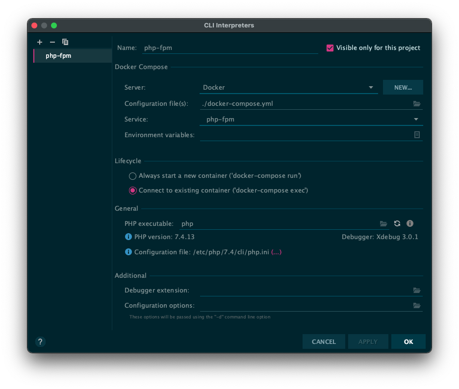
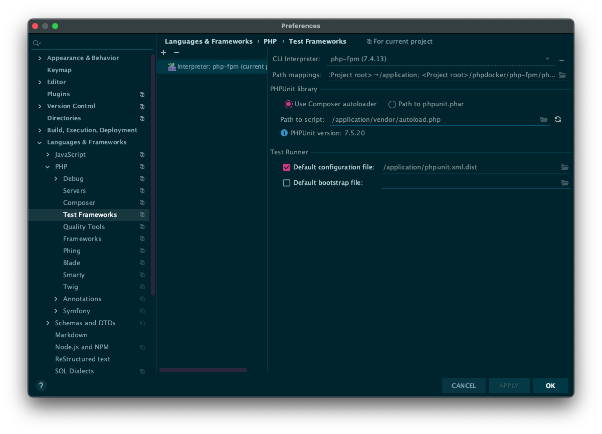

# tb

A dockerized dojo template environment to play with PHP testing and TDD.

This is a base project that can serve as starting point or dojo to practice with php testing and symfony 4.

## List of code exercises

* [FizzBuzz](tests/Katas/FizzBuzz)
* [To-do list](tests/Katas/TodoList)
* [Greetings](tests/Katas/Greetings)
* [Leap Year](tests/Katas/LeapYear)
* [PrimeFactors](tests/Katas/PrimeFactors)
* [Elephant Carpaccio](tests/Katas/ElephantCarpaccio)

## Goodies

`App\Lib\FileStorageEngine` provides a simple persistence engine for some applications.

## Setup details

Docker environment includes a php 7.4 installation with Postgres and XDebug configured.

[Details](phpdocker/README.md)

Set up:

```
docker-compose up -d
docker exec -it tb-php-fpm composer install
```

Configure your IDE:

PHPStorm set up CLI interpreter

Cli Interpreter: (Remote interpreter)



Test Frameworks: (Remote interpreter)


